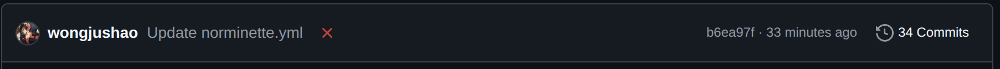
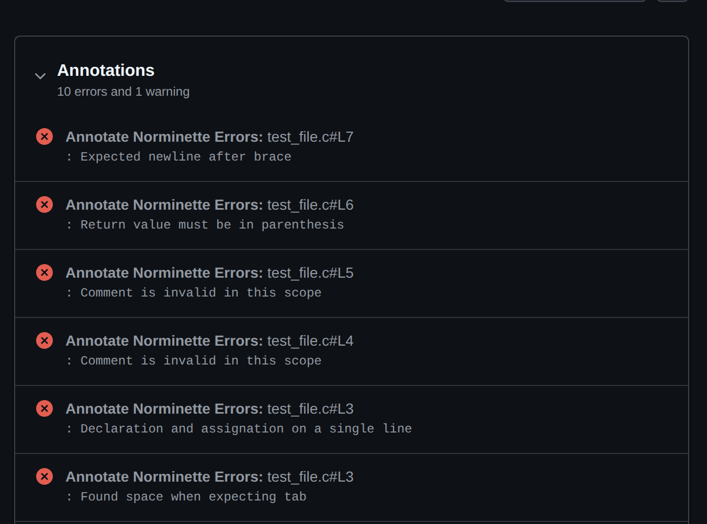
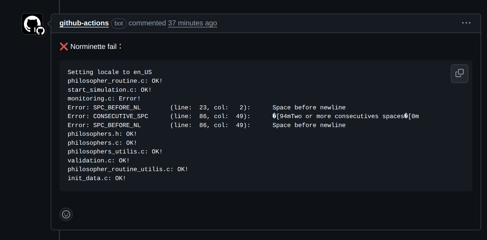
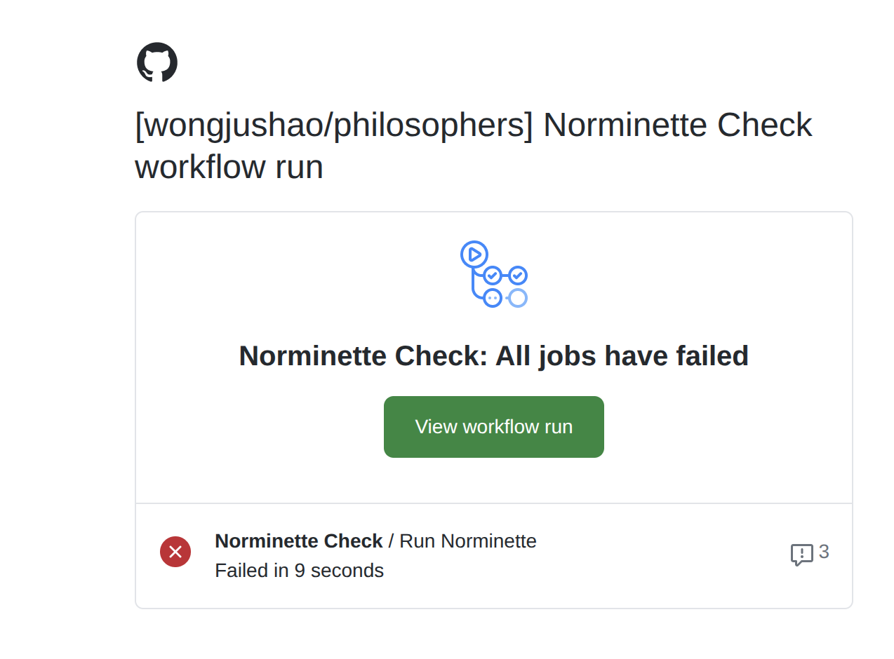

# 📏 github_workflow_42normCheck

A GitHub Action for checking [42 school's](https://42.fr/) C coding standard using **Norminette**.

> Automatically runs [norminette](https://github.com/42School/norminette) on push or pull request, highlights errors in the PR, and uploads a detailed report.

---

## 🚀 Features

- ✅ Automatic **Norminette** check on every push and pull request
- 💬 Comments norm errors directly in Pull Requests (via [peter-evans/create-or-update-comment](https://github.com/peter-evans/create-or-update-comment))
- 📂 Saves a norminette error report as an artifact
- ❌ Fails CI if norminette errors are found

---

## 📦 Installation

1. Copy the workflow file to your repo:

```bash
mkdir -p .github/workflows
curl -o .github/workflows/norminette.yml https://raw.githubusercontent.com/<your-user-or-org>/github_workflow_42normCheck/main/.github/workflows/norminette.yml
```
---

## 🛠️ Usage

Once installed, the workflow will automatically run on:
<br>
1. Pushes to main or develop  
<br>
2. All pull requests  
<br>
### Example Output  

When Norminette finds issues, you'll see:

- ❌ A failed workflow



- 🔍 Inline annotations in PR



- 💬 A PR comment like:



- 📧 An Email like:



## 🙌 Credits

[42 School Norminette](https://github.com/42School/norminette)

[GitHub Actions](https://docs.github.com/en/actions)

[peter-evans/create-or-update-comment](https://github.com/peter-evans/create-or-update-comment)